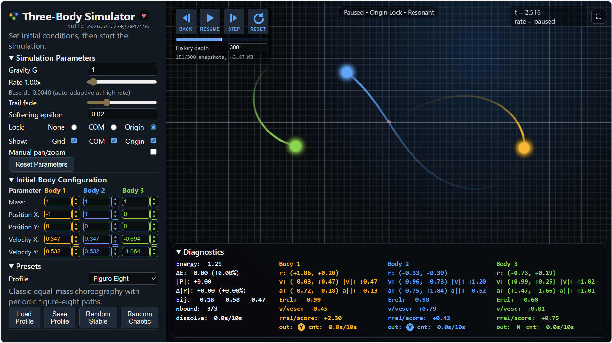

[](https://github.com/gcbartlett/3-body-sim/tags)
[](https://3-body-sim.vercel.app/)
[](https://buymeacoffee.com/gcbartlett)

# Three-Body Simulator

Interactive 2D Newtonian three-body simulator built with React + TypeScript + Vite.  
The app renders three gravitating bodies on a canvas with trails, diagnostics, presets, and runtime controls for camera and integration speed.



## Features

- Velocity Verlet integration with softened gravity
- Live controls for masses, initial positions/velocities, `G`, `dt`, speed, softening, and trail fade
- Built-in presets (Figure Eight, Lagrange Triangle, Chaotic Slingshot, Trojan L4, Euler Collinear, Custom)
- User profile save/load (persisted in `localStorage`)
- Random initial condition generators (`Random Stable`, `Random Chaotic`)
- Ejection detection and dissolution detection with auto-pause
- Diagnostics for energy/momentum drift, pair energies, and per-body kinematics
- Camera lock modes (`None`, `COM`, `Origin`) plus manual pan/zoom
- Snapshot-backed rewind (`Back`) with configurable history depth and usage metrics
- Hold-to-accelerate stepping for both forward and backward step controls

## Tech Stack

- React 19
- TypeScript 5.9
- Vite 8
- Vercel Web Analytics (`@vercel/analytics/react`)
- Vercel Speed Insights (`@vercel/speed-insights/react`)

## Versioning

Builds use a short CalVer derived from Git commit metadata: `YYYY.MM.DD+g<shortSha>`, auto-updated when commits change.

## Analytics

The app includes Vercel Web Analytics and Vercel Speed Insights to track high-level usage and real-user performance trends in deployed environments.
This helps monitor behavior and identify regressions after releases.

### Privacy Note

- This repository uses `@vercel/analytics/react` via `<Analytics />` in `src/main.tsx`.
- This repository uses `@vercel/speed-insights/react` via `<SpeedInsights />` in `src/main.tsx`.
- The app does not send custom analytics events or user identifiers from application code.
- User-created simulation settings/presets are stored locally in browser `localStorage` and are not sent to a backend by this app.
- If you deploy a public instance, review your host privacy disclosures and Vercel Analytics settings before launch.

## Getting Started

### Runtime and demo options

This app runs entirely in the browser with no server/backend component, so local development (`npm run dev`) is the primary way to run it.
For a live demo, you can also use the Vercel deployment at `https://3-body-sim.vercel.app/`, subject to project usage limits.
Vercel automatically rebuilds and redeploys when the GitHub repository (`https://github.com/gcbartlett/3-body-sim`) is updated, so the live demo stays on the latest version.

### Prerequisites

- Node.js `20.19+` or `22.12+`
- TypeScript language baseline: `ES2022` (for type-checking/editor support)
- Modern browsers matching Vite's default build target (`baseline-widely-available`): Chrome `111+`, Edge `111+`, Firefox `114+`, Safari/iOS Safari `16.4+`

### Install

```bash
npm install
```

### npm scripts

- `npm run dev`: start the Vite development server
- `npm run build`: type-check `src`, then create a production build with Vite
- `npm run preview`: serve the production build locally
- `npm run lint`: run ESLint checks
- `npm run lint:fix`: run ESLint and auto-fix where possible
- `npm run test`: run the Vitest suite once
- `npm run test:verbose`: run Vitest with the verbose reporter
- `npm run test:coverage`: run Vitest with coverage output

### Tests

Unit tests live under `tests/unit/`, mirroring feature areas from `src/` when practical.
Tests may import app modules via the `~` alias (for example `~/src/sim/physics`), which resolves from the repository root.

## Controls

### Simulation

- `Start / Pause / Resume` to control time evolution
- `Back` to rewind one captured simulation frame
- `Step` to advance one integration step
- `Reset` to reset to current initial conditions
- `History depth` input to set rewind buffer size (with live snapshot/memory usage feedback)

### Keyboard shortcuts

- `Space`: start / pause / resume
- `+` or `=` or numpad `+`: increase simulation rate
- `-` or `_` or numpad `-`: decrease simulation rate
- `Right Arrow`: step forward (hold to accelerate burst stepping)
- `Left Arrow`: step backward when history exists (hold to accelerate burst stepping)
- `L`: cycle lock mode (`None -> COM -> Origin`)
- `G`: toggle grid
- `C`: toggle center-of-mass marker
- `O`: toggle origin marker
- `Esc`: exit manual pan/zoom mode

### Canvas interaction

- Mouse drag (manual mode): pan
- Mouse wheel (manual mode): zoom
- Touch drag / pinch (manual mode): pan / zoom
- Double-click canvas: return to auto camera mode
- Hover near a body: show body tooltip diagnostics

## Simulation and Data Internals

Simulation behavior details and persistence (`localStorage`) notes are documented in `docs/ARCHITECTURE.md`.

## Project Structure

Key directories and files:

```text
src/
  App.tsx, main.tsx, styles.css
  sim/             # physics/integration/policies/selectors/session logic
  ui/              # React components, dialogs, UI hooks
  render/          # canvas renderer

tests/
  unit/sim/        # simulation unit tests
  unit/ui/         # UI unit tests     

docs/
  README.md
  ARCHITECTURE.md  # full detailed project structure
```

For the complete file-by-file map, see `docs/ARCHITECTURE.md`.

## Current Scope

- Planar (2D) simulation only
- Exactly three bodies
- No backend; everything runs in-browser

## License

This project is licensed under the MIT License. See `LICENSE` at the repository root.

## Contributing and Support

- Contributing guide: `CONTRIBUTING.md`
- Code of Conduct: `CODE_OF_CONDUCT.md`
- Security reporting: `SECURITY.md`

### ☕ Support This Project

If you find this project useful, consider supporting its development:

👉 https://buymeacoffee.com/gcbartlett

It helps with maintenance, improvements, and new features.

### Maintenance Expectations

This project is maintained on a best-effort basis.
There is no guaranteed response or fix SLA for issues or pull requests.
